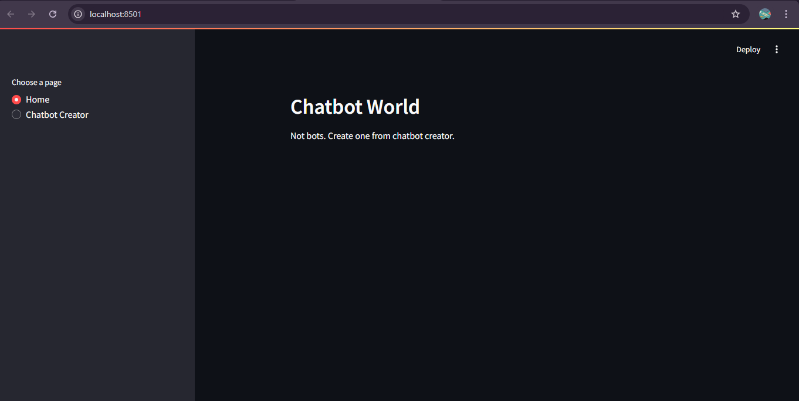
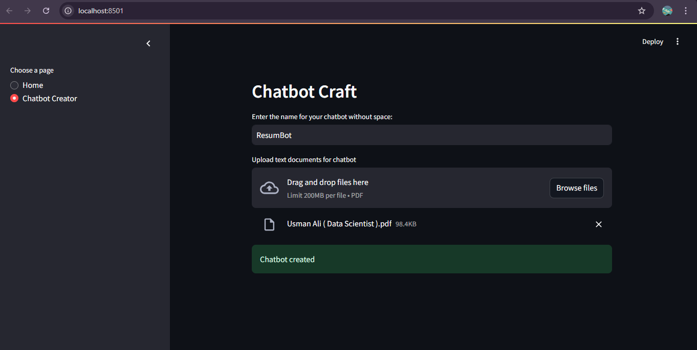
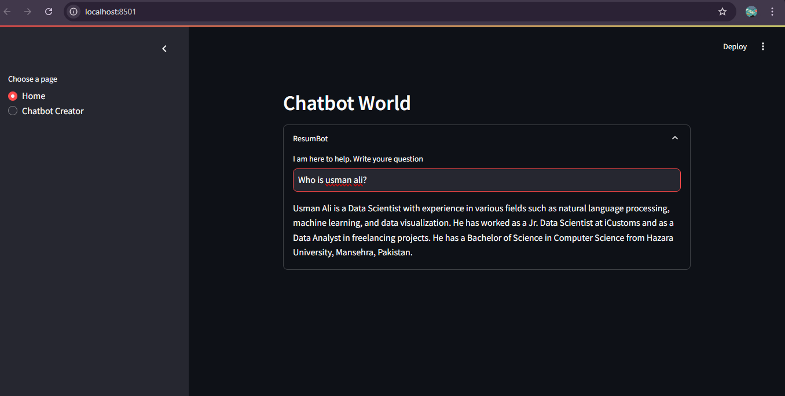

# Chatbot World

## Overview
A Streamlit application that allows users to create and interact with custom chatbots using document-based knowledge bases.

## Features
- Create chatbots by uploading PDF documents
- Interact with created chatbots
- Uses Groq for LLMs
- Persistent storage of chatbot configurations

## Prerequisites
- Python 3.10+
- Required libraries:
  - streamlit
  - langchain
  - chromadb
  - unstructured

## Installation
1. Clone the repository
```bash
git clone <your-repo-url>
cd <project-directory>
```

2. Install dependencies
```bash
pip install -r requirements.txt
```

## Project Structure
```
project/
│
├── src/
│   ├── chatbot_handler.py
│   ├── vectorStore_creator.py
│   └── chain.py
│
└── main.py
```

## Usage
Run the application:
```bash
streamlit run main.py
```

### Chatbot Creator Page
1. Enter a unique chatbot name
2. Upload PDF documents
3. Click create to generate your chatbot

### Home Page
- View and interact with created chatbots
- Ask questions based on uploaded documents

## Configuration
- Modify `src/vectorStore_creator.py` for custom embedding configurations
- Adjust `src/chain.py` to change response generation logic

## Note
- Create a .env file in the root directory containing Groq api key.

## Demo
#### Here are some screenshots from the app.
- Chatbot app

- Chatbot creation

- Chatbot usage
